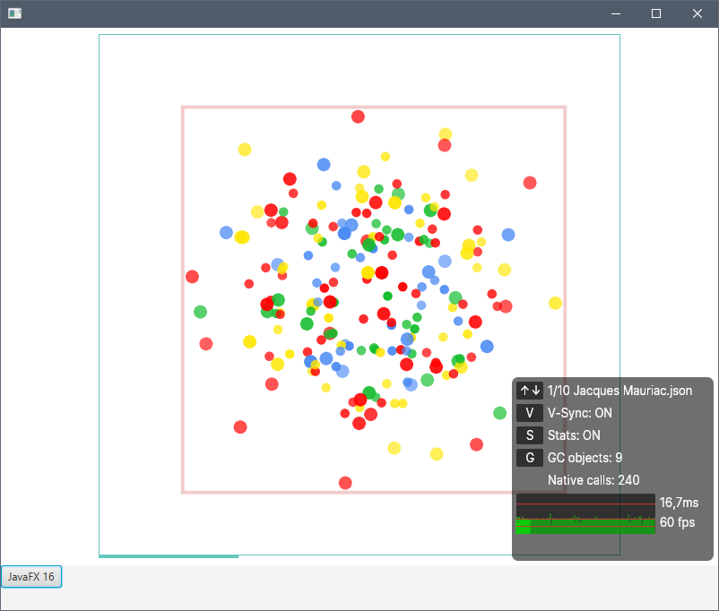

# Skija-jogl-JavaFX Testing


references/copied resources from:

https://github.com/JetBrains/skija

https://github.com/jzy3d/jogl-maven-deployer


JavaFX SDK path must be changed to your local one

```xml
<javafx16sdk>C:\\Java\\openjfx\\javafx-sdk-16\\lib</javafx16sdk>
```

```xml
<javafx16sdk>/Library/Java/JavaFX/javafx-sdk-16/lib</javafx16sdk>
```

run with jdk16 (windows or macos)

```console
mvn verify exec:java
```

