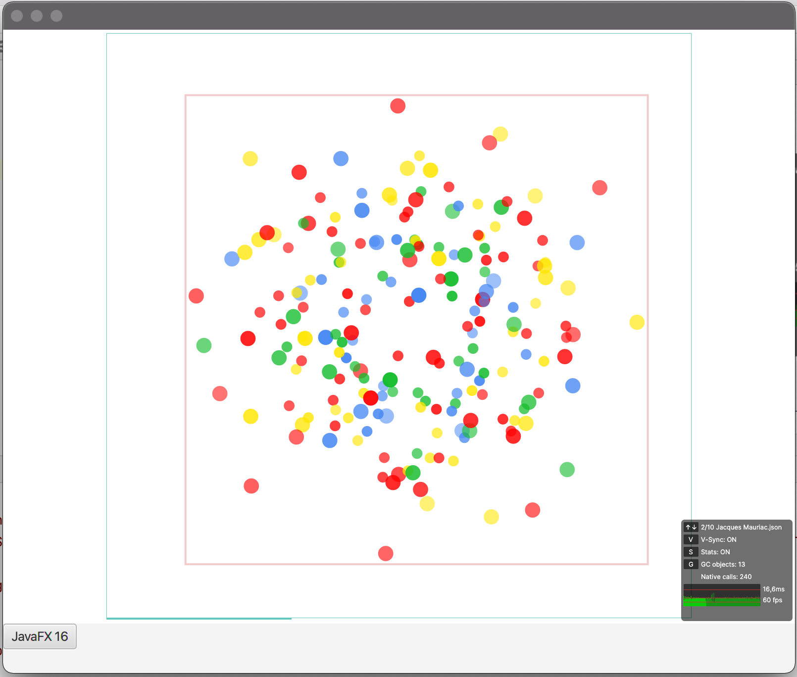

# Skija-jogl-JavaFX Testing


references/copied resources from:

https://github.com/JetBrains/skija

https://github.com/jzy3d/jogl-maven-deployer


JavaSDK path must be changed to your local one

```xml
<javafx16sdk>/Library/Java/JavaFX/javafx-sdk-16/lib</javafx16sdk>
```

run with other OS than MacOS x64 please change the jogl and skija platform

```xml
<skija.platform>macos-x64</skija.platform>
<jogl.platform>macosx-universal</jogl.platform>
```

```
--module-path /Library/Java/JavaFX/javafx-sdk-16/lib 
--add-modules javafx.controls 
--add-opens javafx.graphics/com.sun.javafx.tk=ALL-UNNAMED 
--add-opens javafx.graphics/com.sun.javafx.tk.quantum=ALL-UNNAMED 
--add-opens javafx.graphics/com.sun.glass.ui=ALL-UNNAMED 
--add-opens javafx.graphics/javafx.stage=ALL-UNNAMED 
-Djava.awt.headless=true 
-Djogamp.debug.JNILibLoader=true 
-Djogamp.debug.NativeLibrary=true
```
